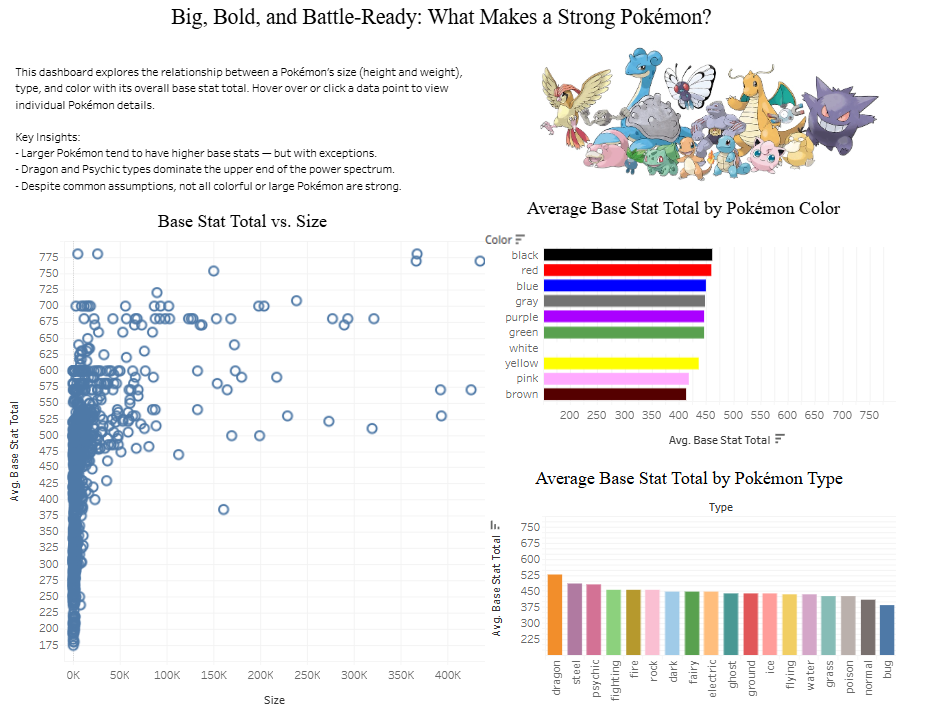

# Big, Bold, and Battle-Ready: What Makes a Strong Pokémon? (Tableau)

## Overview
This Tableau dashboard investigates how a Pokémon’s type, color, height, and weight relate to its overall strength, measured by base stat total. The dashboard presents interactive visualizations that explore correlations and patterns between a Pokémon’s physical and categorical traits and their battle capabilities.

View the dashboard live here: [Tableau Public Link](https://public.tableau.com/app/profile/james.mosher/viz/pokemon_17449239212600/Dashboard1)

---

## Data Sources

Excel to Tableau

---

## Key Insights

- Larger Pokémon tend to have higher base stats — but with exceptions.
- 
- Dragon and Psychic types dominate the upper end of the power spectrum.
- 
- Despite common assumptions, not all colorful or large Pokémon are strong.

---

## Tools/Sites Used
- Excel
- Tableau Public

---

## Screenshot

---

## Additional Notes

This was my first attempt at a dashboard using:

-Dashboard layout formatting

-Floating objects

-Calculated Fields

-General filtering

On my next dashboard, I want to make sure I utilize pgAdmin queries and connect relevant data/ideas.

---

## Author
Created by [James Mosher](https://www.linkedin.com/)

